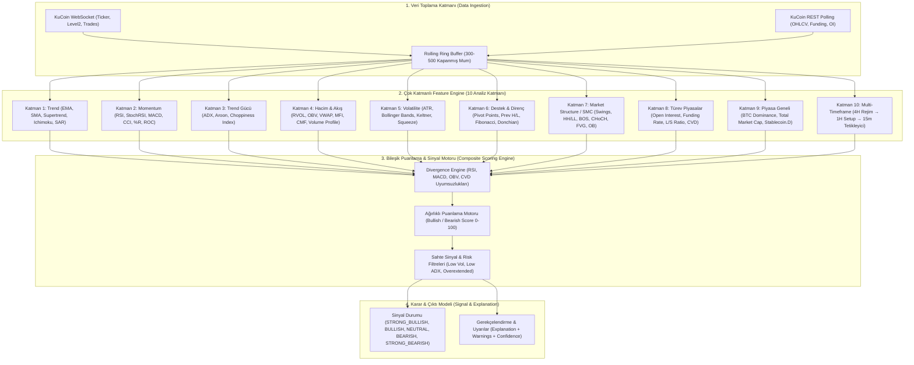

# Modül 2 Spesifikasyonu: Piyasa Verileri, Çok Katmanlı İndikatörler ve Analiz Motoru

> **Tasarım & Spesifikasyon Durumu:** %100 (Onaylandı & Genişletildi ✅) | **Kodlama & Test Durumu:** %100 Tamamlandı (10 Analiz Katmanının Tamamı, Sub-15m, Spot/Margin/Futures Analizi, Eğitici Tablo & Seviyeli Grafik Dahil, Toplam 180/180 Test %100 Yeşil ✅, Coverage %81) | **Son Güncelleme:** 2026-09-20 17:35:00 (+03:00)

---

## 1. Modülün Amacı ve Mimarisi

Bu modül, KuCoin borsasından canlı ticker, emir defteri (order book) ve mum (OHLCV) verilerini toplar; bunları hafızada kayan önbelleklerde (rolling ring buffer) saklar. 

Temel felsefe: **"Asla tek bir indikatöre göre AL/SAT kararı vermemek"**tir. Bunun yerine sistem, bağımsız 10 analitik katmandan normalleştirilmiş feature'lar çıkarır; çoklu zaman dilimi (Multi-Timeframe) filtrelerinden geçirir ve ağırlıklı bir **Bileşik Puanlama Motoru (Composite Scoring Engine)** ile insan tarafından okunabilir gerekçeler ve risk filtreleri barındıran sinyal çıktıları üretir.

### 1.1. Uçtan Uca Analiz Motoru Akış Şeması



### 1.2. Aşamalı Geliştirme ve Uygulama Yol Haritası (Faz 2a & Faz 2b)

Coding AI'ın tek seferde aşırı büyük bir implementasyon yükü altında kalmasını önlemek ve birim testlerle adım adım ilerlemek amacıyla Modül 2 iki mantıksal faza ayrılmıştır:

```
+---------------------------------------------------------------------------------------+
|  FAZ 2a: Çekirdek Piyasa Verisi, Temel İndikatörler & API Omurgası                   |
|  - KuCoin Ticker, L2 Order Book & Spread Takibi                                       |
|  - OHLCV Ring Buffer (300-500 Mum) & Repaint/Lookahead Koruması                      |
|  - Temel İndikatörler: Trend (EMA, SMA), Momentum (RSI, MACD), Volatilite (ATR)      |
|  - Temel REST API'ler: /ticker, /orderbook, /candles, /symbols, /analysis/indicators   |
+---------------------------------------------------------------------------------------+
                                           |
                                           v
+---------------------------------------------------------------------------------------+
|  FAZ 2b: Gelişmiş Çok Katmanlı Motor, SMC, Türevler & Bileşik Puanlama (0-100)        |
|  - İleri Düzey İndikatörler: Supertrend, Ichimoku, ADX, Choppiness, RVOL, VWAP, CMF  |
|  - SMC / Fiyat Hareketi: Lookahead-proof Swings, BOS, CHoCH, FVG, Order Block         |
|  - Türev Veriler & Uyumsuzluk Motoru (OI, Funding, CVD, Divergence Engine)            |
|  - MTF Hiyerarşisi (4H Rejim → 1H Setup → 15m Tetikleyici)                            |
|  - 0-100 Composite Scoring Engine, Sahte Sinyal Filtreleri & Gerekçelendirme Motoru   |
|  - İleri REST API'ler: /analysis/structure, /analysis/score, /analysis/mtf            |
+---------------------------------------------------------------------------------------+
```

---

## 2. Veri Katmanı ve Toplama Yöntemleri (Data Ingestion Layer)

### 2.1. Piyasa Ticker ve Emir Defteri (Order Book)
* **Ticker Verisi**:
  * Anlık son fiyat (`last_price`)
  * 24 saatlik en yüksek (`high_24h`) ve en düşük (`low_24h`)
  * 24 saatlik hacim (`volume_24h`) ve baz hacim (`quote_volume_24h`)
  * 24 saatlik yüzdesel değişim (`change_percentage_24h`)
* **Emir Defteri (Level 2 Micro-structure)**:
  * En iyi alış (`best_bid`) ve satış (`best_ask`)
  * Alış-Satış Makası (Bid-Ask Spread) ve Spread Yüzdesi
  * Sipariş Derinlik Dengesizliği (Order Book Imbalance: `(BidVol - AskVol) / (BidVol + AskVol)`)

### 2.2. Mum (OHLCV) Veri Mimarisi ve Ring Buffer
* **Desteklenen Zaman Dilimleri (Timeframes)**:
  * Makro Rejim: `4h`, `1d`
  * Ara Kurulum (Setup): `1h`
  * Giriş / Tetikleyici (Trigger): `15m`, `5m`, `1m`
* **Veri Yapısı (Immutable OHLCV)**:
  `[timestamp, open, high, low, close, volume]`
* **Hafıza Yönetimi (Rolling Ring Buffer)**:
  * Her bir aktif sembol ve timeframe çifti için hafızada minimum **300 ile 500** kapanmış mum tutulur.
  * Bu tampon, EMA 200 ve Ichimoku Span B (52 periyot) gibi uzun vadeli indikatörlerin ısınma (warm-up) gereksinimini tam karşılar.

### 2.3. Veri Kalitesi, Isınma (Warm-up) ve Repainting Önleme Standartları
1. **Repainting Koruması**:
   * Henüz tamamlanmamış (açık) olan anlık mum, sinyal onayında kullanılmaz.
   * `confirmed_candle` (kapanmış kesin mum) ile `intrabar_provisional` (mum içi geçici durum) kesin hatlarla ayrılır.
   * Modül 3'e gidecek kalıcı emir tetikleyicileri yalnızca **kapanışı kesinleşmiş mum** verisi ile üretilir.
2. **Lookahead Bias (Geleceğe Bakma Hatası) Önleme**:
   * Multi-timeframe verileri birleştirilirken, yüksek timeframe mumunun (örn. 4H) kapanış zamanı gelmeden alt timeframe'e (örn. 15m) kesinleşmiş veri aktarılmaz (`lookahead_off`).
   * Swing tepe/dip noktaları tespit edilirken, sağ taraftaki doğrulama mumları kapanmadan swing noktası teyit edilmiş sayılmaz.
3. **Eksik Veri (Data Quality Management)**:
   * Yetersiz mum sayısı veya borsa veri kesintilerinde (`NaN` / `null`), sistem bu durumu `bearish` veya `bullish` olarak yorumlayamaz.
   * Açıkça `data_quality: "UNAVAILABLE"` veya `"DEGRADED"` durumu atanır ve sinyal üretimi dondurulur.
4. **Isınma Süresi (Warm-up Period)**:
   * Sistem başlatıldığında indikatör motoru en az $\max(\text{lookback\_periods}) + 50$ mumluk geçmişi KuCoin REST API'den yüklemeden aktif sinyal üretimine geçmez.

---

## 3. Çok Katmanlı Analiz Motoru (10 Analiz Katmanı Detayı)

### 3.1. Katman 1: Trend İndikatörleri
Trend yönünü ve dinamik destek/direnç eşiklerini tayin eder.

* **EMA (Exponential Moving Average)**:
  * Periyotlar: `20`, `50`, `100`, `200`.
  * Formül: $\alpha = \frac{2}{N+1}$, $\text{EMA}_t = \alpha \cdot P_t + (1-\alpha) \cdot \text{EMA}_{t-1}$.
  * Yorum:
    * $P > \text{EMA}_{200}$ ve $\text{EMA}_{50} > \text{EMA}_{200}$ $\rightarrow$ Güçlü Bullish Trend Yapısı (Golden Cross).
    * $P < \text{EMA}_{200}$ ve $\text{EMA}_{50} < \text{EMA}_{200}$ $\rightarrow$ Güçlü Bearish Trend Yapısı (Death Cross).
* **SMA (Simple Moving Average)**: `50`, `200` periyotluk temel trend filtresi.
* **Supertrend**:
  * Parametreler: Periyot = 10, Çarpan (Multiplier) = 3.0 (ATR bazlı dinamik takip).
  * Çıktı: `direction` (`1`: Bullish, `-1`: Bearish), `trend_price`.
* **Ichimoku Kinko Hyo**:
  * Parametreler: Tenkan-sen = 9, Kijun-sen = 26, Senkou Span B = 52, Chikou = 26.
  * Senkou Span A/B Bulutu (Kumo): Fiyat bulutun üzerinde ise alıcı eğilim, içinde ise kararsızlık (konsolidasyon), altında ise satıcı eğilim.
* **Parabolic SAR (Stop and Reverse)**:
  * Parametreler: Hızlanma Faktörü ($AF$) = 0.02, Maksimum $AF$ = 0.20.
  * SAR noktasının mumun altında olması alım baskısını, üstünde olması satış baskısını teyit eder.

### 3.2. Katman 2: Momentum İndikatörleri
Fiyatın hareket hızını, ivmesini ve aşırı uç noktalarını ölçer.

* **RSI (Relative Strength Index)**:
  * Standart Periyot: 14. Wilder smoothing kullanılır.
  * Eşikler: $< 30$ Aşırı Satış (Oversold), $> 70$ Aşırı Alım (Overbought), $50$ Çizgisi (Trend Ayracı).
  * Feature Çıktısı: `value`, `slope_3_bars` (eğim), `regime` (`BULLISH_ABOVE_50`, `BEARISH_BELOW_50`).
* **Stochastic RSI**:
  * $\text{StochRSI} = \frac{\text{RSI} - \min(\text{RSI}, 14)}{\max(\text{RSI}, 14) - \min(\text{RSI}, 14)}$.
  * K (%3 SMA) ve D (%3 SMA) çizgileri kesişimi. Eşikler: 20 ve 80.
* **MACD (Moving Average Convergence Divergence)**:
  * Parametreler: Hızlı EMA = 12, Yavaş EMA = 26, Sinyal EMA = 9.
  * $\text{MACD Line} = \text{EMA}_{12} - \text{EMA}_{26}$, $\text{Signal Line} = \text{EMA}_9(\text{MACD Line})$.
  * $\text{Histogram} = \text{MACD Line} - \text{Signal Line}$.
  * Feature Çıktısı: Histogram eğimi (artıyor/azalıyor) ve sıfır çizgisi geçişi.
* **CCI (Commodity Channel Index)**: Periyot 20. Tipik fiyatın ortalama sapması. Eşikler: $\pm 100$.
* **Williams %R**: Periyot 14. Eşikler: $-20$ ve $-80$.
* **ROC (Rate of Change)**: $N=9$ periyotluk oransal fiyat değişimi yüzdesi.

### 3.3. Katman 3: Trend Gücü İndikatörleri (Trend Strength)
Piyasanın bir trend içinde mi yoksa yatay bantta (chop / range) mı olduğunu belirler.

* **ADX (Average Directional Index)**:
  * Periyot: 14. True Range, $+DI$ ve $-DI$ bileşenleri ile Wilder Smoothing.
  * Eşik Değerlendirmesi:
    * $\text{ADX} < 20$: Trend Yok / Zayıf Range (Trend stratejileri kapatılır).
    * $20 \le \text{ADX} \le 25$: Trend Başlangıç / Gelişme Evresi.
    * $25 < \text{ADX} < 40$: Güçlü Trend (Trend-following için optimum bölge).
    * $\text{ADX} \ge 40$: Çok Güçlü / Aşırı Uzamış Trend (Klimaks ve tükenme riski).
* **Aroon**:
  * Periyot: 25. Aroon Up ve Aroon Down ($0-100$). Aroon Oscillator $= \text{Up} - \text{Down}$.
* **Choppiness Index (CI)**:
  * Periyot: 14. $\text{CI} = 100 \times \frac{\log_{10}(\sum \text{TR} / (\text{MaxHigh} - \text{MinLow}))}{\log_{10}(N)}$.
  * $\text{CI} > 61.8$: Konsolidasyon / Yatay Bant (Chop). Kırılım stratejileri beklenir.
  * $\text{CI} < 38.2$: Trend Patlaması.

### 3.4. Katman 4: Hacim ve Para Akışı İndikatörleri (Volume & Flow)
Fiyat hareketinin gerçek kurumsal katılım ve hacimle desteklenip desteklenmediğini teyit eder.

* **Relative Volume (RVOL)**:
  * $\text{RVOL} = \frac{\text{Current Volume}}{\text{SMA}_{20}(\text{Volume})}$.
  * $\text{RVOL} > 1.5$: Yüksek hacim teyidi (Breakout onaylayıcı).
  * $\text{RVOL} < 0.7$: Düşük hacim uyarısı (Sahte kırılım riski).
* **OBV (On-Balance Volume)**:
  * Mum kapanışı önceki mumdan yüksekse hacim eklenir, düşükse çıkarılır.
  * OBV EMA20 sinyali ve fiyata göre eğim uyumu kontrol edilir.
* **VWAP (Volume Weighted Average Price)**:
  * Günlük Oturum VWAP (Session Intraday VWAP): $\text{VWAP} = \frac{\sum (P_{\text{typical}} \times V)}{\sum V}$.
  * Standart Sapma Bantları ($\pm 1\sigma, \pm 2\sigma$).
  * Fiyatın VWAP üzerinde olması kurumsal alım eğilimini, altında olması satış eğilimini gösterir.
* **Anchored VWAP (AVWAP)**:
  * Önemli swing yüksek/düşük noktalarından veya haber mumlarından çıpalanmış ağırlıklı ortalama fiyat.
* **MFI (Money Flow Index)**: Hacim ağırlıklı RSI (Periyot 14). Para giriş/çıkış yoğunluğu.
* **CMF (Chaikin Money Flow)**:
  * Periyot: 20. Akümülasyon / Dağıtım hacim toplamı oranı.
  * $\text{CMF} > +0.05$: Net sermaye girişi.
  * $\text{CMF} < -0.05$: Net sermaye çıkışı.
* **Volume Profile (VPVR)**:
  * **POC (Point of Control)**: Belirli dönemde en yüksek hacmin gerçekleştiği fiyat seviyesi (mıknatıs seviye).
  * **VAH (Value Area High)** ve **VAL (Value Area Low)**: Toplam hacmin %70'inin gerçekleştiği değer alanı sınırları.

### 3.5. Katman 5: Volatilite İndikatörleri
Piyasadaki risk genişliğini, sıkışmaları ve stop-loss mesafelerini belirler.

* **ATR (Average True Range)**:
  * Periyot: 14. True Range'in Wilder hareketli ortalaması.
  * **Normalized ATR %**: $\frac{\text{ATR}}{\text{Close}} \times 100$.
  * **Dinamik Stop-Loss**: Modül 3 için $1.5 \times \text{ATR}$ veya $2.0 \times \text{ATR}$ taban stop mesafesi.
* **Bollinger Bands (BB)**:
  * Parametreler: Periyot = 20, Standart Sapma = 2.0.
  * Bant Genişliği ($\text{BandWidth} = \frac{\text{Upper} - \text{Lower}}{\text{Middle}}$).
  * %B Değeri ($\%B = \frac{\text{Price} - \text{Lower}}{\text{Upper} - \text{Lower}}$).
* **Keltner Channels (KC)**:
  * EMA 20 merkezli, $1.5 \times \text{ATR}$ bant genişliği.
* **Bollinger / Keltner Volatility Squeeze**:
  * Bollinger Bantları, Keltner Kanallarının içine girdiğinde (`BB_Upper < KC_Upper` ve `BB_Lower > KC_Lower`):
  * **SQUEEZE_ON**: Volatilite aşırı sıkışmıştır, büyük bir patlama yakındır.
  * **SQUEEZE_RELEASE**: Bantlar tekrar KC dışına çıktığında momentum yönünde sert hareket başlar.
* **Historical Volatility (HV)**: Logaritmik getirilerin standart sapmasının yıllıklandırılmış hali.

### 3.6. Katman 6: Destek ve Direnç Seviyeleri
Kritik fiyat dönüş ve hedef seviyelerini belirler.

* **Klasik Pivot Points (Günlük)**:
  * Pivot ($P$) $= \frac{H + L + C}{3}$.
  * Destekler: $S_1 = 2P - H$, $S_2 = P - (H - L)$, $S_3 = L - 2(H - P)$.
  * Dirençler: $R_1 = 2P - L$, $R_2 = P + (H - L)$, $R_3 = H + 2(P - L)$.
* **Önceki Periyot Seviyeleri (High/Low)**:
  * PDH (Previous Day High) / PDL (Previous Day Low).
  * PWH (Previous Week High) / PWL (Previous Week Low).
* **Fibonacci Düzeltme Seviyeleri (Retracement)**:
  * Swing tepe ve dip aralığı: `%23.6`, `%38.2`, `%50.0`, `%61.8` (Golden Pocket), `%78.6`.
* **Donchian Channels**: Son 20 periyodun en yüksek ve en düşük değer kanalları.

### 3.7. Katman 7: Market Structure (Fiyat Hareketi & Smart Money Concepts - SMC)
Fiyat yapısının kurumsal ayak izlerini ve likidite alanlarını modeller.

* **Swing Noktası Tespiti (Lookahead Korumalı)**:
  * Bir tepe/dip noktasının Swing High/Low olması için solunda $N$ adet daha düşük/yüksek bar ve sağında $N$ adet teyit barı aranır (Varsayılan: $N=3$ veya $N=5$).
* **Trend Yapısı**:
  * **Bullish Structure**: Ardışık Higher Highs (HH) ve Higher Lows (HL).
  * **Bearish Structure**: Ardışık Lower Highs (LH) ve Lower Lows (LL).
* **BOS (Break of Structure - Yapı Kırılımı)**:
  * Trend yönündeki son swing tepe noktasının mumun **gövde kapanışı** ile yukarı kırılması (Bullish BOS).
  * Son swing dip noktasının gövde kapanışı ile aşağı kırılması (Bearish BOS).
* **CHoCH (Change of Character - Karakter Değişimi)**:
  * Yükselen trendde son Higher Low noktasının aşağı kırılması (Ayı dönüş sinyali).
  * Düşen trendde son Lower High noktasının yukarı kırılması (Boğa dönüş sinyali).
* **Liquidity Sweep (Likidite Avı / Stop Avı)**:
  * Fiyatın önceki kritik swing seviyesini sadece bir fitil (wick) ile geçmesi ve aynı bar veya bir sonraki barda hızla seviyenin içine geri kapanması.
* **FVG (Fair Value Gap / Dengesizlik)**:
  * 3 barlık seri: Mum 1'in tepesi ile Mum 3'ün dibi arasında temas olmaması durumunda oluşan verimsiz fiyat boşluğu. Bullish FVG (destek bölgesi) ve Bearish FVG (direnç bölgesi).
* **Order Block (OB)**:
  * Güçlü bir BOS hareketi başlatmadan önceki son zıt yönlü mum (kurumsal alım/satım bloğu).

### 3.8. Katman 8: Türev Veriler (KuCoin Derivatives / Futures Entegrasyonu)
Vadeli işlem piyasasının spot fiyat üzerindeki baskısını ve kurumsal pozisyonlanmayı ölçer.

* **Open Interest (OI)**:
  * Açık pozisyon miktarı.
  * Fiyat $\uparrow$ + OI $\uparrow$ $\rightarrow$ Güçlü trende yeni sermaye girişi (Bullish teyit).
  * Fiyat $\uparrow$ + OI $\downarrow$ $\rightarrow$ Short covering / Zayıf ralli (Tükenme uyarısı).
  * Fiyat $\downarrow$ + OI $\uparrow$ $\rightarrow$ Agresif yeni short pozisyon girişi (Bearish teyit).
  * Fiyat $\downarrow$ + OI $\downarrow$ $\rightarrow$ Long tasfiyesi / Zayıf düşüş.
* **Funding Rate (Fonlama Oranı)**:
  * Aşırı pozitif fonlama ($> +0.03\%$): Long tarafı aşırı kalabalık (Long Squeeze riski).
  * Aşırı negatif fonlama ($< -0.03\%$): Short tarafı aşırı kalabalık (Short Squeeze fırsatı).
* **Long / Short Oranı (L/S Ratio)**: KuCoin üst düzey trader pozisyon oranı.
* **Likidasyon Hacmi (Liquidations)**: Ani long veya short tasfiye kaskadlarının tespiti.
* **CVD (Cumulative Volume Delta)**: Piyasa alıcıları (taker buy) ile piyasa satıcıları (taker sell) arasındaki kümülatif net fark. Fiyat yükselirken CVD düşüyorsa bearish divergence uyarısı üretir.
* **Basis**: Futures Fiyatı ile Spot Fiyatı arasındaki prim/iskonto farkı.

### 3.9. Katman 9: Piyasa Geneli Rejim Göstergeleri (Market-wide Regime)
Altcoinlerin piyasa konjonktürüne göre risk katsayısını belirler.

* **BTC Dominance (BTC.D)**:
  * BTC yükselirken BTC.D artıyorsa: Altcoinler için risk modu yüksek (Sadece BTC veya defansif mod).
  * BTC yatayken BTC.D düşüyorsa: Altcoin rallisi (Altseason setup).
* **Total Market Cap & Total3**:
  * Kripto toplam piyasa değeri ve BTC+ETH hariç altcoin piyasa hacmi trendi.
* **Stablecoin Dominance (USDT.D / USDC.D)**:
  * Stablecoin dominansı yükseliyorsa: Nakite kaçış (Risk-off piyasa).

### 3.10. Katman 10: Multi-Timeframe (MTF) Karar Hiyerarşisi
Üç seviyeli hiyerarşik doğrulama modeli uygulanır:

```
[ 4H : Makro Piyasa Rejimi (Regime) ]
  ├── EMA 200 konumu (Bullish / Bearish)
  ├── Ichimoku Kumo konumu
  └── ADX trend gücü (> 20)
            ↓  (Yalnızca 4H yönüyle uyumlu kurulumlar aranır)
[ 1H : Fiyat Kurulumu (Setup) ]
  ├── VWAP geri çekilmesi (Pullback)
  ├── 1H FVG veya Order Block testi
  └── RSI 50 üzeri toparlanma ve MACD histogram artışı
            ↓  (Kurulum sağlandığında alt zaman dilimi tetikleme bekler)
[ 15m / 5m : Hassas Giriş Tetikleyicisi (Trigger) ]
  ├── 15m Bullish BOS kırılımı
  ├── Hacim patlaması (RVOL > 1.5)
  └── CVD onaylı VWAP reclaim
```

---

## 4. Feature Engine ve Bileşik Puanlama Motoru (Composite Scoring Engine)

### 4.1. Normalize Edilmiş Feature Engine Veri Sözlüğü
Her indikatör katmanı, aşağıdaki normalize JSON veri formatında feature seti üretir:

```json
{
  "symbol": "BTC-USDT",
  "timeframe": "15m",
  "timestamp": 1773780000000,
  "data_quality": "CONFIRMED",
  "features": {
    "trend": {
      "price_above_ema200": true,
      "ema50_above_ema200": true,
      "supertrend_direction": 1,
      "ichimoku_above_cloud": true,
      "sar_bullish": true
    },
    "momentum": {
      "rsi_value": 62.4,
      "rsi_above_50": true,
      "rsi_slope": 1.8,
      "stoch_rsi_k": 72.0,
      "stoch_rsi_cross_up": true,
      "macd_hist_positive": true,
      "macd_hist_rising": true
    },
    "strength": {
      "adx_value": 28.5,
      "plus_di_above_minus_di": true,
      "choppiness_index": 36.2,
      "is_trending": true
    },
    "volume": {
      "rvol": 1.85,
      "price_above_vwap": true,
      "obv_slope": 3.1,
      "cmf_value": 0.12,
      "mfi_value": 58.0
    },
    "volatility": {
      "atr_14": 420.5,
      "natr_pct": 1.25,
      "bb_width": 0.045,
      "squeeze_status": "RELEASE_BULLISH"
    },
    "structure": {
      "current_swing": "HH",
      "recent_bos": "BULLISH_BOS",
      "fvg_active": true,
      "order_block_retest": false
    },
    "derivatives": {
      "oi_change_pct": 3.4,
      "funding_rate": 0.0001,
      "funding_status": "NORMAL",
      "cvd_slope": "POSITIVE"
    }
  }
}
```

### 4.2. Ağırlıklı Puanlama Algoritması (0 - 100 Puan)
Sistem iki bağımsız puan hesaplar: $\text{Score}_{\text{bull}}$ ve $\text{Score}_{\text{bear}}$.

| Katman | Feature Kontrolü | Boğa Puanı (+B) | Ayı Puanı (+A) |
| :--- | :--- | :---: | :---: |
| **Trend (%25)** | $P > \text{EMA}_{200}$ & $\text{EMA}_{50} > \text{EMA}_{200}$ | +15 | 0 |
| | $P < \text{EMA}_{200}$ & $\text{EMA}_{50} < \text{EMA}_{200}$ | 0 | +15 |
| | Supertrend Bullish / Bearish | +5 | +5 |
| | Ichimoku Kumo Üzerinde / Altında | +5 | +5 |
| **Momentum (%20)** | RSI $> 50$ & Eğim $> 0$ (Boğa) / RSI $< 50$ & Eğim $< 0$ (Ayı) | +8 | +8 |
| | MACD Histogram Pozitif & Yükseliyor | +7 | +7 |
| | StochRSI K $< 20$ dip dönüşü (+5 Boğa) / $> 80$ tepe dönüşü (+5 Ayı) | +5 | +5 |
| **Hacim & Akış (%20)** | $\text{RVOL} > 1.5$ & $P > \text{VWAP}$ | +10 | 0 |
| | $\text{RVOL} > 1.5$ & $P < \text{VWAP}$ | 0 | +10 |
| | $\text{CMF} > +0.05$ / $\text{CMF} < -0.05$ | +5 | +5 |
| | OBV EMA20 Üzerinde / Altında | +5 | +5 |
| **Market Structure (%20)** | Bullish BOS (Mum kapanış onaylı) | +12 | 0 |
| | Bearish BOS (Mum kapanış onaylı) | 0 | +12 |
| | Bullish FVG veya Order Block Tepkisi | +8 | 0 |
| | Bearish FVG veya Order Block Tepkisi | 0 | +8 |
| **Türev & Güç (%15)** | $\text{ADX} > 25$ (Trend Var Onayı) | +5 | +5 |
| | OI Artışı + CVD Yükselişi (+5 Boğa) / CVD Düşüşü (+5 Ayı) | +10 | +10 |
| **Toplam Maksimum Puan** | | **100** | **100** |

### 4.3. Sinyal Durumları ve Karar Eşikleri
* **`STRONG_BULLISH`**: Net Boğa Skoru $\ge 80$ ve Sahte Sinyal Filtresi = GEÇTİ.
* **`BULLISH`**: $60 \le \text{Net Boğa Skoru} < 80$.
* **`NEUTRAL`**: Boğa ve Ayı Skorları dengede ($40 < \text{Skor} < 60$) veya Choppiness Index $> 61.8$.
* **`BEARISH`**: $60 \le \text{Net Ayı Skoru} < 80$.
* **`STRONG_BEARISH`**: Net Ayı Skoru $\ge 80$ ve Sahte Sinyal Filtresi = GEÇTİ.

### 4.4. Sahte Sinyal ve Risk Filtreleri (False Signal Filters)
Herhangi bir filtre ihlal edildiğinde, yüksek puan olsa dahi sinyal seviyesi düşürülür veya `WARNING` bayrağı eklenir:
1. **Düşük Hacim Filtresi (Low Volume Trap)**: Kırılım (BOS) var ancak $\text{RVOL} < 0.8$ ise $\rightarrow$ `WARNING: WEAK_VOLUME_BREAKOUT`.
2. **Düşük ADX Filtresi (Range Trap)**: $\text{ADX} < 20$ veya $\text{CI} > 61.8$ ise trend takip sinyalleri engellenir $\rightarrow$ `WARNING: CHOPPY_MARKET_DO_NOT_TREND_TRADE`.
3. **Aşırı Uzama Filtresi (Overextended Price)**: Fiyat $\text{EMA}_{50}$'den $2.5 \times \text{ATR}$ kadar uzaklaşmışsa yeni giriş engellenir $\rightarrow$ `WARNING: PRICE_OVEREXTENDED_HIGH_PULLBACK_RISK`.
4. **Çelişkili Timeframe Filtresi (MTF Conflict)**: 4H Rejim Bearish iken 15m'de Bullish sinyal oluşursa $\rightarrow$ `STATUS: COUNTER_TREND_SETUP` (Risk yarıya indirilir).
5. **Aşırı Fonlama Filtresi (Funding Extreme)**: Funding Rate $> +0.03\%$ iken Alım Sinyali $\rightarrow$ `WARNING: FUNDING_CROWDED_LONG_SQUEEZE_RISK`.

### 4.5. Uyumsuzluk Motoru (Divergence Engine)
Fiyat swing noktaları ile indikatör (RSI, MACD, OBV, CVD) swing noktaları kıyaslanır:
* **Klasik Boğa Uyumsuzluğu (Regular Bullish Divergence)**: Fiyat Lower Low (LL) yaparken, indikatör Higher Low (HL) yapıyorsa $\rightarrow$ Güçlü Dip Dönüşü Potansiyeli.
* **Klasik Ayı Uyumsuzluğu (Regular Bearish Divergence)**: Fiyat Higher High (HH) yaparken, indikatör Lower High (LH) yapıyorsa $\rightarrow$ Güçlü Tepe Dönüşü Potansiyeli.
* **Gizli Uyumsuzluk (Hidden Divergence)**: Trend devam modellerini teyit eder.

### 4.6. İnsan Tarafından Okunabilir Gerekçelendirme Motoru (Explainable AI)
Bot yalnızca `BUY` veya `SELL` üretmez. UI üzerinde ve API yanıtında şu gerekçeleri sunar:
```text
[BULLISH SETUP - KUVVETLİ]
Dayanaklar:
+ Fiyat ve EMA50, EMA200'ün üzerinde (Makro Boğa Trendi)
+ ADX: 28.5 (Trend güçlü)
+ RSI: 62.4 (Pozitif momentum, aşırı alım bölgesinde değil)
+ 15m Zaman Diliminde Kapanış Onaylı Bullish BOS Oluştu
+ Hacim 20 barlık ortalamanın 1.85 katı (RVOL Onaylı)
+ Fiyat VWAP üzerinde ve CMF net sermaye girişini teyit ediyor (+0.12)
Uyarılar & Riskler:
- Funding Oranı hafif yüksek (%0.012)
- En yakın direnç seviyesi: Pivot R1 (68,450 USDT) mesafesi %0.8
```

---

## 5. Veri Modelleri ve Pydantic Şemaları (Data Contracts)

Aşağıdaki şemalar `src/modules/module2_market.py` veya `src/schemas/market.py` içerisinde tanımlanacaktır:

```python
from datetime import datetime
from enum import Enum
from typing import Any, Dict, List, Optional
from pydantic import BaseModel, Field


class SignalDirection(str, Enum):
    STRONG_BULLISH = "STRONG_BULLISH"
    BULLISH = "BULLISH"
    NEUTRAL = "NEUTRAL"
    BEARISH = "BEARISH"
    STRONG_BEARISH = "STRONG_BEARISH"


class MarketRegime(str, Enum):
    TRENDING_BULLISH = "TRENDING_BULLISH"
    TRENDING_BEARISH = "TRENDING_BEARISH"
    RANGING = "RANGING"
    HIGH_VOLATILITY_CHOP = "HIGH_VOLATILITY_CHOP"
    TRANSITION = "TRANSITION"


class Candle(BaseModel):
    timestamp: int = Field(..., description="Milisaniye cinsinden Unix zaman damgası")
    open: float = Field(..., description="Açılış fiyatı")
    high: float = Field(..., description="En yüksek fiyat")
    low: float = Field(..., description="En düşük fiyat")
    close: float = Field(..., description="Kapanış fiyatı")
    volume: float = Field(..., description="İşlem hacmi")
    is_confirmed: bool = Field(True, description="Mumun kapanıp kapanmadığı bilgisi")


class TickerData(BaseModel):
    symbol: str
    last_price: float
    high_24h: float
    low_24h: float
    volume_24h: float
    quote_volume_24h: float
    change_pct_24h: float
    best_bid: float
    best_ask: float
    spread_pct: float
    timestamp: int


class IndicatorLayersData(BaseModel):
    trend: Dict[str, Any]
    momentum: Dict[str, Any]
    strength: Dict[str, Any]
    volume: Dict[str, Any]
    volatility: Dict[str, Any]
    levels: Dict[str, Any]


class MarketStructureData(BaseModel):
    swings: List[Dict[str, Any]]
    bos_events: List[Dict[str, Any]]
    choch_events: List[Dict[str, Any]]
    fvg_zones: List[Dict[str, Any]]
    order_blocks: List[Dict[str, Any]]


class SignalEvaluation(BaseModel):
    symbol: str
    timeframe: str
    direction: SignalDirection
    regime: MarketRegime
    bull_score: int = Field(..., ge=0, le=100)
    bear_score: int = Field(..., ge=0, le=100)
    net_score: int = Field(..., ge=-100, le=100)
    confidence: str = Field(..., description="LOW, MEDIUM, HIGH")
    reasons: List[str]
    warnings: List[str]
    stop_loss_suggested: Optional[float] = None
    take_profit_suggested: Optional[float] = None
    timestamp: int
```

---

## 6. Modül 2 REST API Endpoint'leri ve Swagger Spesifikasyonu

Swagger Tag: `Market Data & Multi-Layer Analysis`

| Metod | Endpoint | Parametreler | Açıklama | Swagger Yanıt Modeli |
| :--- | :--- | :--- | :--- | :--- |
| `GET` | `/api/v1/market/ticker` | `symbol: str` | Anlık fiyat, 24s değişim ve en iyi alış/satış spread verisini getirir. | `TickerData` |
| `GET` | `/api/v1/market/orderbook` | `symbol: str`, `depth: int=20` | Canlı emir defteri (L2 bid/ask) ve mikro dengesizlik oranını döner. | `OrderBookResponse` |
| `GET` | `/api/v1/market/candles` | `symbol: str`, `timeframe: str`, `limit: int=200` | Doğrulanmış geçmiş mum (OHLCV) listesini getirir. | `List[Candle]` |
| `GET` | `/api/v1/market/symbols` | - | KuCoin'de aktif geçerli işlem çiftlerini getirir. | `List[str]` |
| `GET` | `/api/v1/market/analysis/indicators` | `symbol: str`, `timeframe: str` | 6 temel indikatör katmanının ham ve hesaplanmış feature değerlerini döner. | `IndicatorLayersData` |
| `GET` | `/api/v1/market/analysis/structure` | `symbol: str`, `timeframe: str` | Fiyat hareketi & SMC verilerini (Swings, BOS, CHoCH, FVG, OB) döner. | `MarketStructureData` |
| `GET` | `/api/v1/market/analysis/score` | `symbol: str`, `timeframe: str` | Bileşik puanlama motorunun (0-100), rejim, gerekçe ve risk uyarılarının tam çıktısı. | `SignalEvaluation` |
| `GET` | `/api/v1/market/analysis/mtf` | `symbol: str` | 4H (Rejim), 1H (Setup) ve 15m (Tetikleyici) çoklu zaman dilimi analiz özetini döner. | `MTFAnalysisResponse` |

---

## 7. Spesifikasyon ↔ Uygulama (Kod) İzlenebilirlik Tablosu

Bu bölüm, **Coding AI** tarafından kodlama aşamasında eksiksiz takip edilecek ve dosya eşleşmelerini garanti altına alacak izlenebilirlik tablosudur. İki aşamalı yol haritası (`[Faz 2a]` ve `[Faz 2b]`) açıkça belirtilmiştir:

| Bileşen / Özellik No | Aşama | Spesifikasyon Maddesi | Karşılık Gelen Kod / Modül Dosyası | Karşılık Gelen Test Dosyası | Durum |
| :--- | :---: | :--- | :--- | :--- | :---: |
| **M2-C01** | **Faz 2a** | KuCoin Ticker & OrderBook Fetching | `src/modules/module2_market.py` | `tests/test_module_2_market.py` | ✅ Tamamlandı (4 test geçiyor) |
| **M2-C02** | **Faz 2a** | OHLCV Ring Buffer & Repaint Koruması | `src/modules/module2_market.py` | `tests/test_module_2_market.py` | ✅ Tamamlandı (2 test geçiyor) |
| **M2-C03** | **Faz 2a** | Çekirdek Trend Katmanı (EMA, SMA) | `src/modules/indicators/trend.py` | `tests/test_module_2_indicators.py` | ✅ Tamamlandı (3 test geçiyor) |
| **M2-C04** | **Faz 2a** | Çekirdek Momentum Katmanı (RSI, MACD) | `src/modules/indicators/momentum.py` | `tests/test_module_2_indicators.py` | ✅ Tamamlandı (4 test geçiyor) |
| **M2-C05** | **Faz 2a** | Çekirdek Volatilite Katmanı (ATR) | `src/modules/indicators/volatility.py` | `tests/test_module_2_indicators.py` | ✅ Tamamlandı (2 test geçiyor) |
| **M2-C06** | **Faz 2a** | Temel REST API & Swagger Entegrasyonu | `src/main.py` | `tests/test_module_2_indicators.py` | ✅ Tamamlandı (5 endpoint aktif, 2 test) |
| **M2-C07** | **Faz 2b** | İleri Trend (Supertrend, Ichimoku, SAR) | `src/modules/indicators/trend.py` | `tests/test_module_2_indicators.py` | ✅ Tamamlandı (3 test geçiyor) |
| **M2-C08** | **Faz 2b** | Trend Gücü Katmanı (ADX, Aroon, Choppiness) | `src/modules/indicators/strength.py` | `tests/test_module_2_indicators.py` | ✅ Tamamlandı (3 test geçiyor) |
| **M2-C09** | **Faz 2b** | Hacim & Akış (RVOL, OBV, VWAP, CMF, Profile) | `src/modules/indicators/volume.py` | `tests/test_module_2_volume_levels.py` | ✅ Tamamlandı (5 test geçiyor) |
| **M2-C10** | **Faz 2b** | İleri Volatilite (Bollinger Bands, Keltner Squeeze) | `src/modules/indicators/volatility.py` | `tests/test_module_2_indicators.py` | ✅ Tamamlandı (2 test geçiyor) |
| **M2-C11** | **Faz 2b** | Destek/Direnç (Pivots, Fib, Donchian, Prev H/L) | `src/modules/indicators/levels.py` | `tests/test_module_2_volume_levels.py` | ✅ Tamamlandı (4 test geçiyor) |
| **M2-C12** | **Faz 2b** | Market Structure SMC (Swings, BOS, CHoCH, FVG, OB) | `src/modules/indicators/structure.py` | `tests/test_module_2_structure.py` | ✅ Tamamlandı (8 test geçiyor) |
| **M2-C13** | **Faz 2c** | Türev Veriler & Uyumsuzluk (OI, Funding, CVD, Div) | `src/modules/indicators/derivatives.py` | `tests/test_module_2_phase2c.py` | ✅ Tamamlandı (10 test geçiyor) |
| **M2-C14** | **Faz 2b** | Feature Engine & Normalizasyon | `src/modules/module2_market.py` | `tests/test_module_2_analysis.py` | ✅ Tamamlandı (`_all_features`) |
| **M2-C15** | **Faz 2b** | Composite Scoring Engine (0-100 & Explainability) | `src/modules/analysis/scoring_engine.py` | `tests/test_module_2_analysis.py` | ✅ Tamamlandı (5 test geçiyor) |
| **M2-C16** | **Faz 2b** | False Signal & Risk Filtreleri | `src/modules/analysis/scoring_engine.py` | `tests/test_module_2_analysis.py` | ✅ Tamamlandı (ADX/Chop/Squeeze) |
| **M2-C17** | **Faz 2b** | Multi-Timeframe (4H / 1H / 15m) Hiyerarşisi | `src/modules/analysis/mtf_engine.py` | `tests/test_module_2_analysis.py` | ✅ Tamamlandı (4 test geçiyor) |
| **M2-C18** | **Faz 2c** | 15 Dakika Altı Zaman Dilimleri (`1m`, `3m`, `5m`) | `src/modules/module2_market.py` | `tests/test_market_types.py` | ✅ Tamamlandı (3 test geçiyor) |
| **M2-C19** | **Faz 2c** | Çoklu Piyasa Analizi (`spot`, `margin`, `futures`) | `src/modules/module2_market.py` / `main.py` | `tests/test_market_types.py` | ✅ Tamamlandı (7 test geçiyor) |
| **M2-C20** | **Faz 2c** | Analiz Ekranı Al/Sat Seviyeleri & Seviyeli Mum Grafiği | `static/index.html` / `app.js` | `tests/test_frontend.py` | ✅ Tamamlandı (1 yeni test, UI aktif) |
| **M2-C21** | **Faz 2c** | Sade Dil Piyasa Özeti & Yan Yana 4-Boyutlu Eğitici Gerekçe Tablosu (İndikatör, Neden Oldu, Neyi Gösterir, Neye Sebep Olur) | `src/modules/analysis/scoring_engine.py` / `static/` | `tests/test_module_2_analysis.py` | ✅ Tamamlandı (Tablo/Row UI aktif, 174/174 test %100 yeşil) |
| **M2-C22** | **Faz 2c** | Katman 9: Piyasa Geneli Rejim Göstergeleri (BTC.D, Total MCap, Stablecoin.D - CoinGecko) | `src/modules/market_regime.py` / `main.py` | `tests/test_market_types.py` | ✅ Tamamlandı (2 test geçiyor, dashboard widget aktif) |
| **M2-C23** | **Faz 2c** | Zenginleştirilmiş Koin Seçici (Gerçek Combo Dropdown `<select>`, Watchlist + 20 Popüler KuCoin Paritesi & Hızlı Çipler) | `static/index.html` / `app.js` | `tests/test_bug_reports.py` | ✅ Tamamlandı (6 test geçiyor, Hata #1 çözüldü) |

---

## 8. Doküman Değişiklik ve Tamamlanma Günlüğü (Change Log)

| Tarih / Saat | Versiyon | Yapılan Değişiklikler ve İşlem Özeti | Durum |
| :--- | :---: | :--- | :--- :
| **2026-09-17 20:53:20** | v0.1 | Modül 2 ilk taslağı (Basit Ticker, OHLCV ve modüler analiz arayüzü) oluşturuldu. | Tamamlandı |
| **2026-09-17 21:04:23** | v0.2 | REST API ilk taslak endpoint'leri ve modelleri eklendi. | Tamamlandı |
| **2026-09-17 21:35:00** | v0.3 | Global standartlara uygun tamamlama rozetleri eklendi. | Tamamlandı |
| **2026-09-17 22:50:00** | v1.0 | Kapsamlı Analiz Revizyonu: 10 Analiz Katmanı, SMC, MTF, Ring Buffer, 0-100 Puanlama eklendi. | Tamamlandı |
| **2026-09-19 22:00:00** | v1.1 | Aşamalı Uygulama Optimizasyonu: Kapsam riski yönetildi; Modül 2 iki mantıksal aşamaya bölündü (Faz 2a: Çekirdek Piyasa Verisi, Faz 2b: Gelişmiş SMC & Scoring). | Tamamlandı |
| **2026-09-19 22:52:00** | v1.2 | Faz 2a Temel Veri Katmanı Doğrulandı: Ticker, L2 orderbook, ring buffer ve repaint guard eklendi. (8 birim test) | Tamamlandı |
| **2026-09-19 23:10:00** | v1.3 | Faz 2a Çekirdek İndikatörler %100 Tamamlandı: Trend (EMA/SMA), Momentum (RSI/MACD), Volatilite (ATR) ve API yazıldı. (11 birim test, toplam 48/48 test) | Tamamlandı |
| **2026-09-19 23:25:00** | v1.4 | Faz 2b Analiz, SMC, Scoring ve MTF Motoru %100 Tamamlandı: Trend, Güç, SMC, Puanlama ve MTF yazıldı. (26 yeni test, toplam 74/74 test) | Tamamlandı |
| **2026-09-19 23:48:00** | v1.5 | Hacim ve Destek/Direnç Seviyeleri Katmanları %100 Tamamlandı: `indicators/volume.py` ve `indicators/levels.py` yazıldı. | Tamamlandı |
| **2026-09-20 16:35:00** | v1.6 | Sub-15m Timeframe (`1m`, `3m`, `5m`), Spot/Margin/Futures Analizi & Seviyeli Mum Grafiği Eklendi. | Onaylandı & Genişletildi (%100) ✅ |
| **2026-09-20 16:45:00** | v1.7 | Sade Piyasa Özeti ve 4-Boyutlu Eğitici Gerekçelendirme & Risk Motoru eklendi. | Onaylandı & Genişletildi (%100) ✅ |
| **2026-09-20 17:15:00** | v1.8 | Yan Yana Eğitici Gerekçe Tablosu & Katman 9 (Piyasa Rejimi) %100 Tamamlandı. | Onaylandı & Tamamlandı (%100) ✅ |
| **2026-09-20 17:35:00** | **v1.9** | **Analiz Ekranı Koin Seçici Zenginleştirildi & Hata #1 Çözüldü**: Analiz ekranındaki koin seçimi tekil ve kısıtlayıcı datalist yerine gerçek açılır kutu (`<select id="analysis-symbol-select">`), İzleme Listesi + 20 popüler KuCoin çifti optgroup'ları ve tek tıkla analiz başlatan hızlı koin çipleri (`quick-chips`) ile donatıldı; serbest özel koin girişi korundu (toplam 180 test %100 yeşil, coverage %81). | **Onaylandı & Tamamlandı (%100) ✅** |


